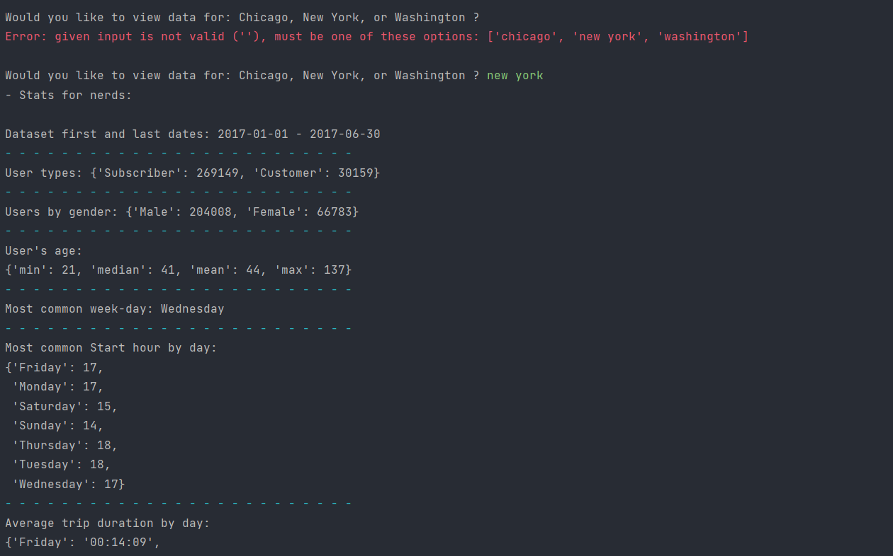
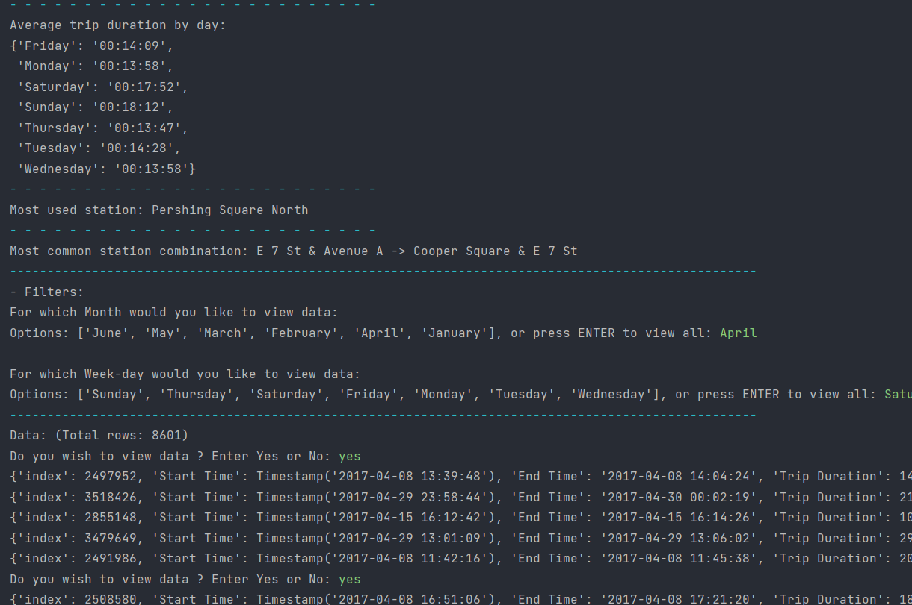

## Bike-share project

A project from Udacity's Data Analyst Nanodegree, where we create a script that analyzes
the bike-share datasets using `Python` and `Pandas`

### The Data:
There are three CSV files in the data folder, with each containing
Bike-share data for its respective city (Chicago, New York, and Washington).\
All three datasets start January 1st 2017, and end on: June 30th 2017.

### Columns
All three of the data files contain the same six columns:

* Start Time (e.g., 2017-01-01 00:07:57)
* End Time (e.g., 2017-01-01 00:20:53)
* Trip Duration (in seconds - e.g., 776)
* Start Station (e.g., Broadway & Barry Ave)
* End Station (e.g., Sedgwick St & North Ave)
* User Type (Subscriber or Customer)

The Chicago and New York City files also have the following two columns:

* Gender (Male or Female)
* Birth Year (e.g., 1985)

The following columns are added when reading the dataset:

* Start hour (e.g, 18)
* Month (e.g, January)
* Weekday (e.g, Wednesday)
* Trip (e.g., Division St & Bowery -> Lafayette St & Jersey St)

## Project Tasks:

The following script must be run in a loop:

* Select dataset
  * Ask user which city they want to view data for
  
* Display Statistics
  * Earliest and most recent date
  * Counts of user types
  * Gender stats
  * Mean and median age

  * Most common day of week
  * Most common start hour per day
  * Mean and median travel time
  * Most used station
  * Most frequent combination of start station and end station

* Filter data
  * Filter by month
  * Filter by weekday
  
* Display data
  * Display five rows of data continuously, until user selects 'no'

## Terminal Output:

---

