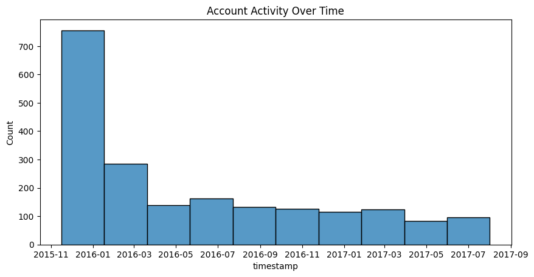
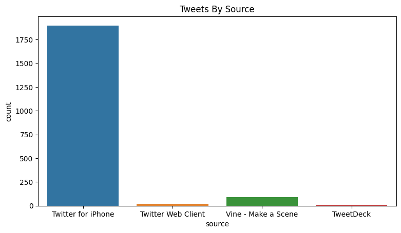
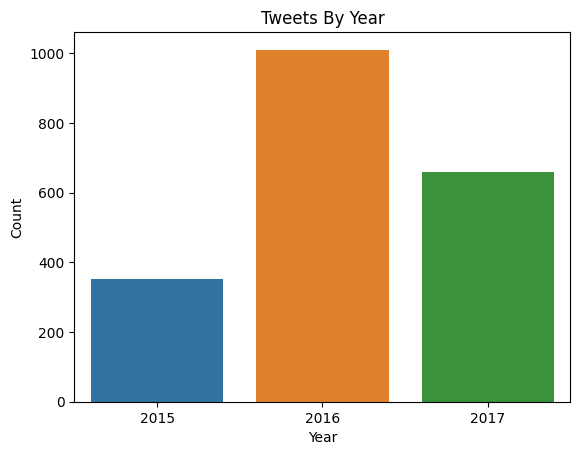
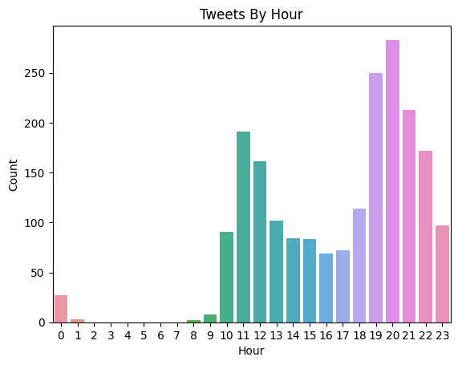
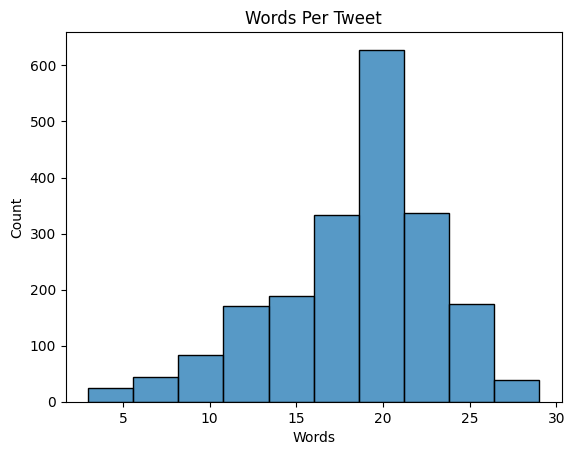

# Data Preprocessing

---

In this project we gathered all the tweets from the twitter account [WeRateDogs](https://twitter.com/dog_rates) from 2015 to 2017 (included),
after cleaning all the data we created some visualizations about it, you can find some of them below (the full report is in [act_report.pdf](act_report.pdf)):

### Account Activity:

### Tweets By Source:

### Tweets By Year:

### Tweets By Hour:

### Words Per Tweet

