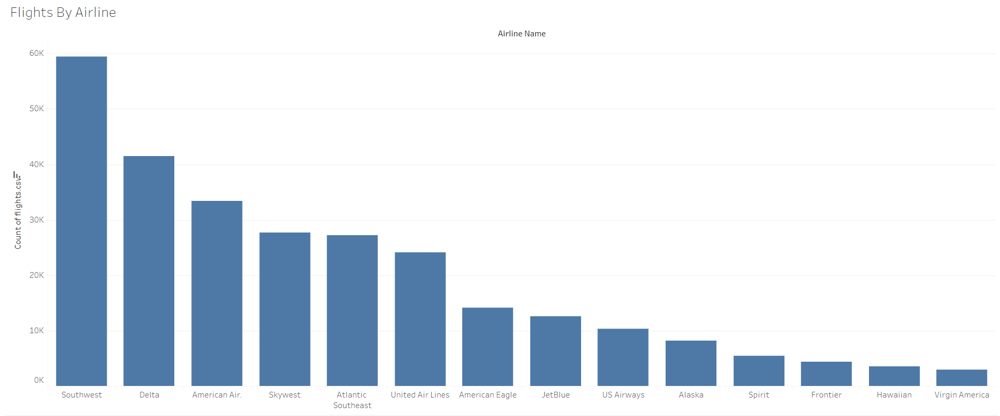

A project from Masterschool's Data Visualization course

Here I created a Tableau chart and worksheet to show my findings about
all the flights that were delayed in the USA in 2015, below are some slides on my findings:

---

---

